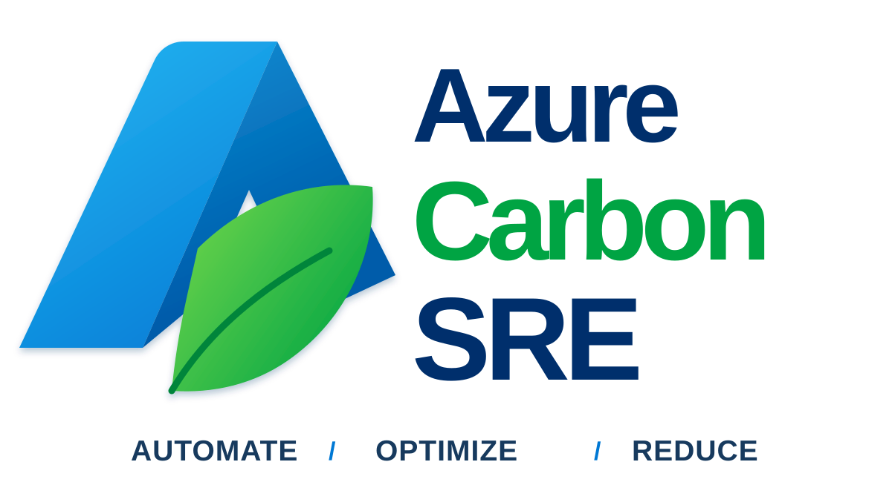

<p align="center">
  
</p>

[](https://tomkerkhove.github.io/azure-sre-agent-plugin-installer/?repo=tomkerkhove%2Fazure-carbon-sre&theme=dark)

Azure Carbon SRE is an Azure SRE Agent plugin marketplace for safe, repeatable Carbon Optimization operations. The installable `azure-carbon-sre` package includes skills for report queries, assessment, spike investigation, optimization recommendations, and Live Report setup.

## Install

End users install this repository as a marketplace, then choose the `azure-carbon-sre` plugin from the marketplace catalog. For direct URL installation, use `plugins/azure-carbon-sre` as the path in the repository.

The importable package declares its skills explicitly in `plugins/azure-carbon-sre/plugin.json`, matching the official Azure SRE Agent marketplace layout. Marketplace installation imports skills only; it cannot execute repository hooks or create a scheduled task.

To install the package and provision a weekly static-snapshot task for each explicitly selected subscription, use the opt-in package installer:

```bash
AGENT_RESOURCE_ID=/subscriptions/<agent-subscription>/resourceGroups/<agent-resource-group>/providers/Microsoft.App/agents/<agent-name> \
CARBON_SUBSCRIPTIONS=<lowercase-subscription-id>[,<lowercase-subscription-id>] \
./plugins/azure-carbon-sre/install-api.sh
```

The installer is idempotent only for exact same-agent task names carrying its immutable ownership marker, and refuses to infer subscription scope, grant Carbon RBAC, delete tasks, or replace another agent's task. See the package [installation guide](plugins/azure-carbon-sre/README.md#install) for configuration and rollback.

## Included plugin

| Plugin | Description |
| --- | --- |
| [`azure-carbon-sre`](plugins/azure-carbon-sre/README.md) | Carbon Optimization reporting, assessment, spike investigation, evidence-gated optimization, and Live Report setup. |

## Prerequisites

Before using a Carbon Optimization skill:

1. Target an Azure subscription with Carbon Optimization data available.
2. Authenticate to Azure Resource Manager (`https://management.azure.com`). For hosted agents, use the agent's managed identity and follow the [managed identity authentication guide](plugins/azure-carbon-sre/README.md#managed-identity-authentication).
3. Grant the calling user, service principal, or managed identity the **Carbon Optimization Reader** role on each target subscription. This role is required for Carbon report queries.
4. Additionally assign the general Azure RBAC **Reader** role when the identity needs to discover Azure resource metadata. It is recommended, but it does not replace **Carbon Optimization Reader**.
5. Use lowercase subscription IDs and first-of-month dates in report requests.
6. Query the available data range before selecting report dates.
7. For a report that refreshes when viewed, configure a read-only Carbon connector. Without a connector, use a scheduled static snapshot only when the user explicitly requests recurring saved output and the agent has scheduled-task, report-save, managed-identity Carbon-query, and local HTML-rendering capabilities.

Do not add client secrets, bearer tokens, customer exports, or unredacted incident data to this repository.

## Carbon Optimization references

- [Export Carbon Optimization emissions data](https://learn.microsoft.com/en-us/azure/carbon-optimization/api-export-data)
- [Query carbon emission data available date range API](https://learn.microsoft.com/en-us/rest/api/carbon/carbon-service/query-carbon-emission-data-available-date-range?view=rest-carbon-2025-04-01)
- [Query carbon emission reports API](https://learn.microsoft.com/en-us/rest/api/carbon/carbon-service/query-carbon-emission-reports?view=rest-carbon-2025-04-01)

## Live Report setup

`carbon-emissions-live-report` supports two dashboard modes. Use the exported [Carbon emissions overview setup](plugins/azure-carbon-sre/templates/live-reports/carbon-emissions-overview.md) with a read-only Carbon connector for view-time refresh. When no connector exists, use its scheduled static-snapshot fallback: a task queries Carbon APIs with the managed identity, renders self-contained HTML, and upserts one report with `allowedTools: []`.

## Repository layout

```text
.
├── .github/plugin/marketplace.json      # Marketplace manifest
├── plugins/azure-carbon-sre/             # Installable plugin package
│   ├── plugin.json                       # Plugin manifest with skills/ declaration
│   ├── install-api.sh                    # Opt-in plugin plus snapshot-task installer
│   ├── scheduled-tasks/                  # Canonical snapshot prompt, renderer, and YAML
│   ├── skills/                           # Production skills imported by the plugin
│   └── templates/                        # Supporting templates; not imported as skills
├── scripts/validate_plugin.py            # Marketplace and package validation
├── requirements-dev.txt                  # Pinned validation dependency
└── CONTRIBUTING.md                       # Skill authoring and safety rules
```

## Contributing another plugin

This section is for marketplace contributors, not an additional installation step:

1. Add a self-contained package under `plugins/<plugin-name>/`.
2. Register the package in [`.github/plugin/marketplace.json`](.github/plugin/marketplace.json).
3. Declare its production skill directories in `plugin.json`; do not add a separate package's skills to `azure-carbon-sre`.
4. Add a package README and an entry in [Included plugin](#included-plugin).
5. Follow the full plugin and skill requirements in [CONTRIBUTING.md](CONTRIBUTING.md), then run the repository validation before opening a pull request.

## Develop

Create skills in `plugins/azure-carbon-sre/skills/<kebab-case-name>/SKILL.md`. Each skill must include frontmatter with a matching `name` and a specific `description` that explains when it should activate.

Validate the marketplace and plugin before opening a pull request:

```bash
python3 -m pip install --requirement requirements-dev.txt
python3 scripts/validate_plugin.py
```

See [CONTRIBUTING.md](CONTRIBUTING.md) for authoring, safety, and review requirements.
